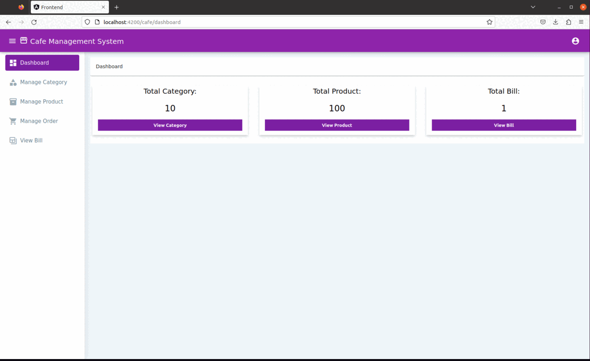
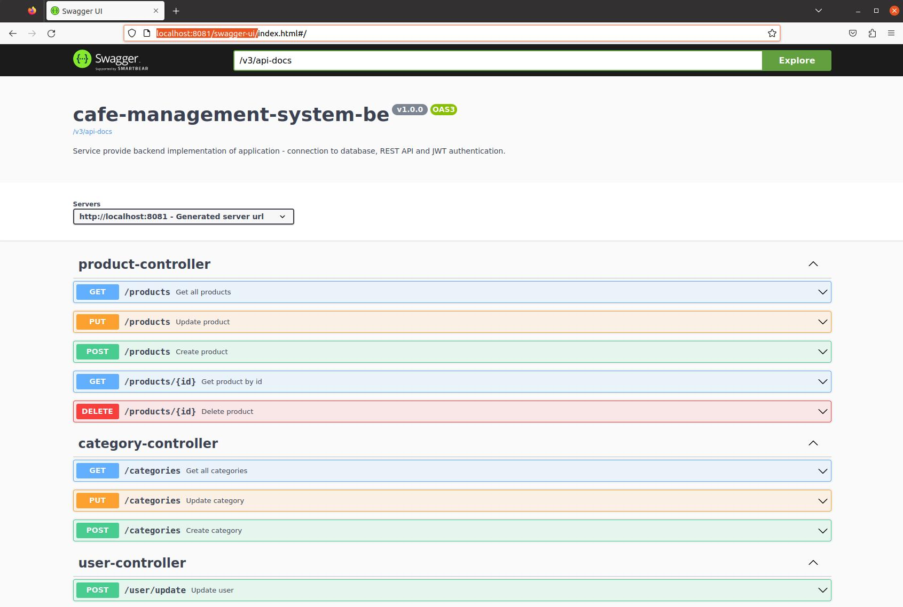
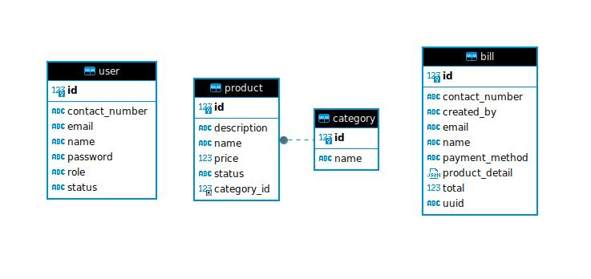

# cafe-management-system
A full stack web application for managing information about products, categories and orders in cafe restaurant.
Application is build on three microservices: cafe-management-system-db, cafe-management-system-be and cafe-management-system-fe.

The application uses technology:
* **Backend**: Java, Spring Boot, Hibernate, Maven, Lombok, MapStruct 
* **Frontend**: HTML, CSS, NPM, TypeScript, Angular
* **Database**: MySQL

## Services
### cafe-management-system-fe
Service provide frontend implementation of the application, 
it consumes REST API from cafe-management-system-be service.



### cafe-management-system-be
Service provide backend implementation of application - connection to database, REST API and JWT authentication.



### cafe-management-system-db
Service contains cafe database in MySQL database for store all application data.



## How to run
```bash
docker build --tag cafe-management-system-db cafe-management-system-db/.
docker build --tag cafe-management-system-be cafe-management-system-be/.
docker build --tag cafe-management-system-fe cafe-management-system-fe/.

docker compose up
```

### Application endpoints
* **cafe-management-system-db**: jdbc:mysql://localhost:33061/cafe
* **cafe-management-system-be**: http://localhost:8081/swagger-ui/index.html
* **cafe-management-system-fe**: http://localhost:4200/
